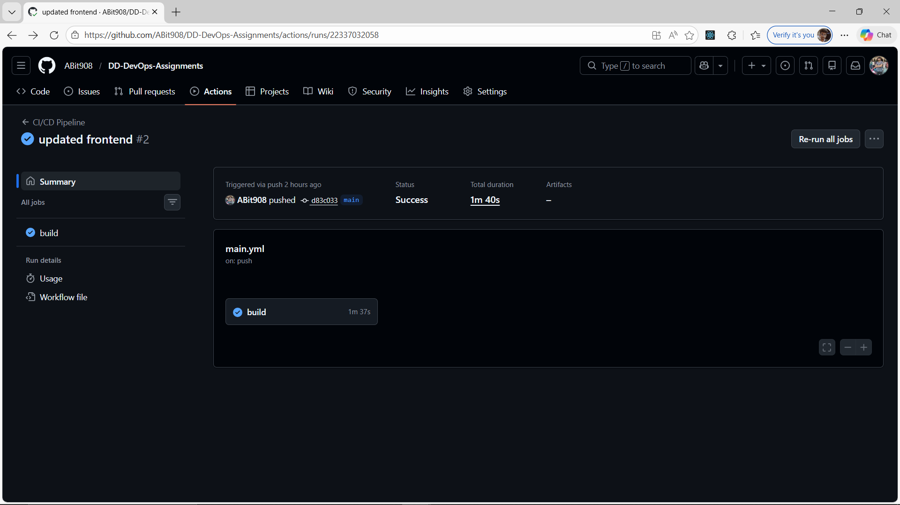
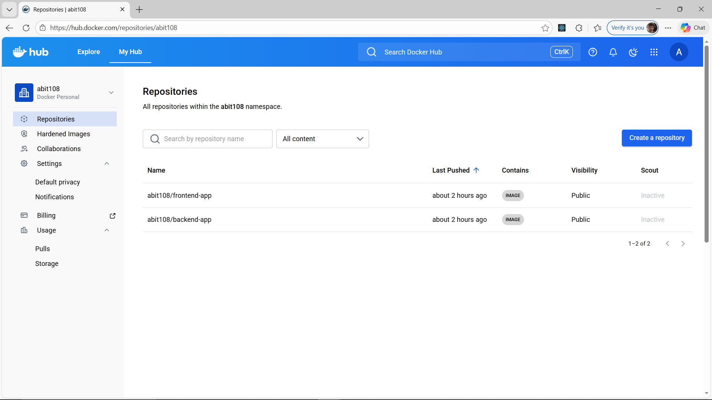
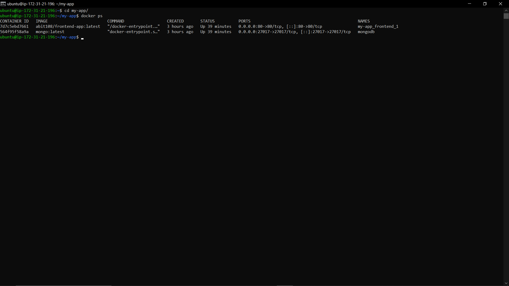
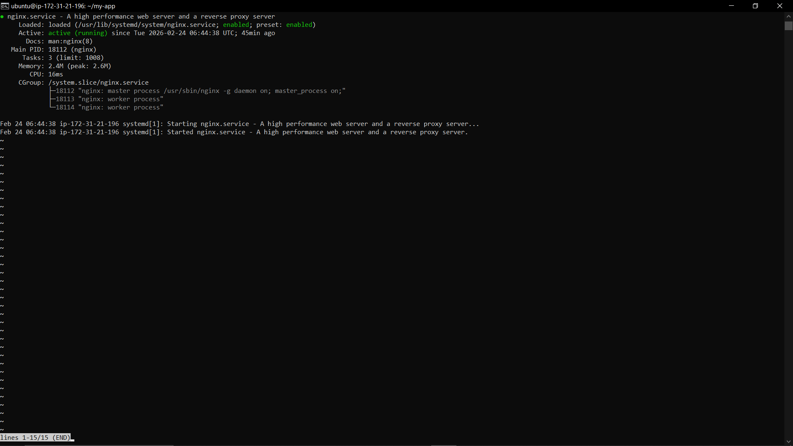
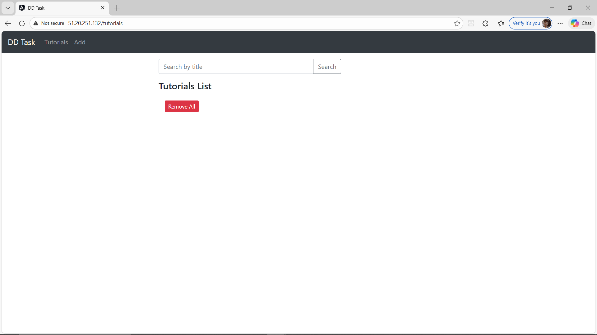
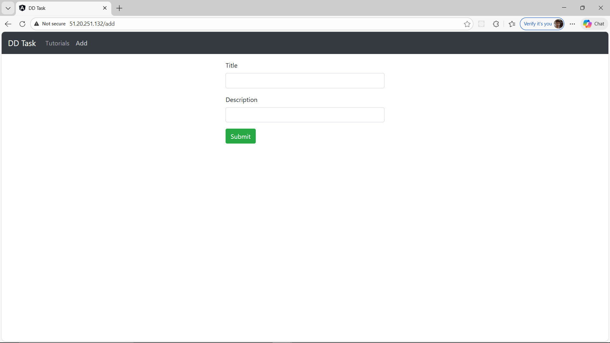

# Full-Stack Angular & Node.js CRUD Application

This repository contains a containerized Full-Stack application (Angular, Node.js, and MongoDB) deployed on an AWS EC2 instance using Docker, Docker Compose, and Nginx as a reverse proxy. The deployment is automated via a GitHub Actions CI/CD pipeline.

## 🚀 Architecture Overview
- **Frontend:** Angular 15 (Dockerized with Nginx Alpine)
- **Backend:** Node.js / Express API
- **Database:** MongoDB
- **Proxy:** Nginx (Host-level) directing traffic to containers
- **CI/CD:** GitHub Actions for automated Building and Pushing to Docker Hub

---

## 🛠️ Setup and Deployment Instructions

### 1. Prerequisites
- AWS EC2 Instance (Ubuntu 22.04)
- Docker & Docker Compose installed on the VM
- Docker Hub account

### 2. Infrastructure Setup (Nginx)
To allow the application to be accessible on Port 80, the host Nginx was reconfigured to avoid conflicts with the Docker Frontend container:
1. Update Nginx to listen on a secondary port (e.g., 8082) or stop the service if Docker takes over Port 80 directly.
2. Ensure AWS Security Groups allow inbound traffic on **Port 80** (HTTP) and **Port 8080** (API).

### 3. CI/CD Configuration
1. Store the following as **GitHub Secrets**:
   - `DOCKERHUB_USERNAME`: Your Docker Hub ID
   - `DOCKERHUB_TOKEN`: Your Personal Access Token (PAT)
2. Every push to the `main` branch triggers the `.github/workflows/main.yml` pipeline to build and push the latest images.

### 4. Deployment on EC2
To deploy the application, SSH into your instance and run:
```bash
# Clone the repository
git clone <your-repo-link>
cd <repo-folder>

# Pull and start the containers
docker-compose up -d

---

## 📸 Deployment Proof & Screenshots

### 1. CI/CD Pipeline Success
Proof of the GitHub Actions workflow successfully building the Docker images and pushing them to the registry.


### 2. Docker Hub Repositories
Verification that the frontend and backend images are successfully hosted on Docker Hub.


### 3. Infrastructure & Container Status
The output of `docker ps` on the AWS EC2 instance, showing all services (Frontend, Backend, MongoDB) are healthy and mapped to the correct ports.


### 4. Nginx Configuration
The status of the host Nginx service acting as the entry point for the infrastructure.


### 5. Application UI (Landing Page)
The Angular application accessible via the AWS Public IP on Port 80.


### 6. Application Functionality (Database Integration)
Demonstrating the full-stack connectivity by performing CRUD operations (Data persistence in MongoDB via the Node.js API).

